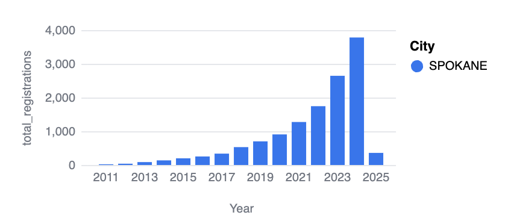

# Electric Vehicle Market Analysis (2010-2025)

## Overview
The electric vehicle (EV) industry has grown rapidly over the past decade, with increasing adoption of battery electric vehicles (BEVs), plug-in hybrid electric vehicles (PHEVs), and hydrogen-powered vehicles. This project analyzes trends in EV registrations, fuel types, price variations, and model performance from 2010 to 2025.

Using data on vehicle registrations, model-specific attributes, and geographic trends, this analysis provides key insights into market growth, vehicle range capabilities, and pricing disparities. The findings highlight consumer preferences, market leaders, and geographic trends in EV adoption.

## Key Insights

### 1. Clean Alternative Fuel Vehicle Registrations
- **Battery Electric Vehicles (BEVs)** dominate the market, with over **225,000** total registrations.
- **Plug-in Hybrid Electric Vehicles (PHEVs)** have a significant but smaller share with **61,287** registrations.
- **Hydrogen-powered vehicles** remain niche, with only **10** total registrations.

### 2. Hydrogen Vehicle Market
- The **Toyota Mirai** is the dominant hydrogen-powered vehicle, accounting for all hydrogen registrations in the dataset.
- Registrations are **very low** compared to BEVs and PHEVs, indicating a slow adoption rate for hydrogen vehicles.
- Sale prices range from **$13,095 to $20,195**, reflecting variability in pricing strategies.

### 3. Largest Price Discrepancies in Used EVs
- Among used EVs, the **Porsche 918** has the largest price difference, with an average MSRP of **$845,000** and an average sales price of **$241,666**, a **$603,333 price drop**.
- The **BMW 740e** and **Porsche Panamera** also exhibit substantial depreciation, indicating a trend where luxury used EVs sell far below their original MSRP.

### 4. Longest-Range Electric Vehicles
- **Tesla dominates** the longest-range EV category, with the **Model S (337 miles), Model 3 (322 miles), Model X (293 miles), and Model Y (291 miles).**
- The **Porsche Macan** also appears on the list with **308 miles**, showing that other manufacturers are competing in range efficiency.

### 5. Geographic Trends in EV Registrations
- **Seattle, Bellevue, and Redmond** have the highest EV registrations, demonstrating strong adoption in Washington State.
- Cities like **Vancouver, Bothell, and Sammamish** also show significant registration numbers, reflecting a high level of EV adoption in urban and suburban areas.

### 6. EV Registrations Over Time
- EV adoption has **steadily increased** from 2010 onward, peaking in **2024**.
- The decline in 2025 could be due to incomplete data or changes in market trends.

### 7. Spokane EV Market Trends
- Spokane’s EV registrations have grown significantly, with a major increase from **2020 to 2024**.
- The **largest spike** occurred in **2024**, aligning with broader trends in increased EV adoption.

### 8. Route Analysis: New Hampshire to Boston
- A specific route analysis between **New Hampshire and Boston** showcases key EV charging points.
- Living in a rural town in New Hampshire, my parents were interested in purchasing an EV. One of the biggest questions they had was whether or not they would be able to drive to my grandmother's house in Boston and back without having to stop at a charger. Given that it is **122 miles** to Boston, it is likely they would not need to stop on the way back.

### 9. Top Electric Vehicle Models by Registrations
- The **Tesla Model Y** leads with **54,402** registrations, followed by the **Model 3** with **44,734**.
- The **Nissan Leaf** is the highest-ranking non-Tesla EV, with **23,343** registrations.
- Chevrolet, Ford, Volkswagen, and Jeep models also feature in the top registered EVs.

## Conclusion
This analysis provides a comprehensive view of the electric vehicle market, highlighting the rapid adoption of BEVs, significant price depreciation in luxury EVs, and the strong dominance of Tesla in long-range vehicles. Geographic trends show major EV adoption in urban centers, while Spokane's market has also grown significantly.

Future research will explore:
- The impact of incentives and policy changes on EV registrations.
- Expansion of hydrogen vehicle adoption and its potential market share.
- The effect of charging infrastructure on EV market penetration.

As the EV market continues to evolve, these insights will help manufacturers, policymakers, and consumers better understand trends and opportunities in sustainable transportation.

